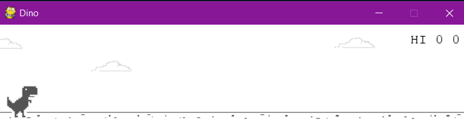
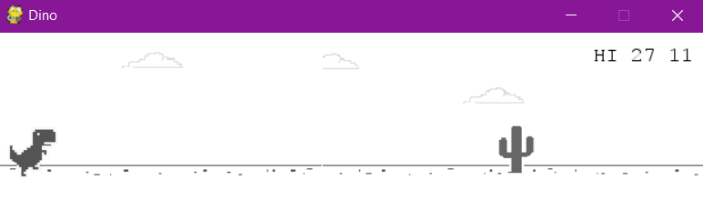
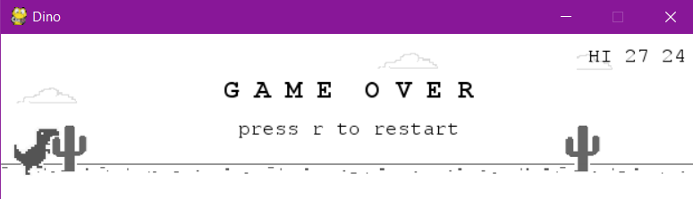

# Dino Game

 A miniature version of dino game using pygame , the image and assets are downloaded from reddit . 

 ## The Rules : 
 1. Install all requirements to run main module
 2. Use requirements.txt ( pip install -r requirements.txt )
 3. Run dino.py
 4. Press Spacebar to start
 5. Press Spacebar to jump
 6. If gameover press 'r' to restart

## Snapshot 1 - Start

## Snapshot 2 - Playing

## Snapshot 3 - Game Over
